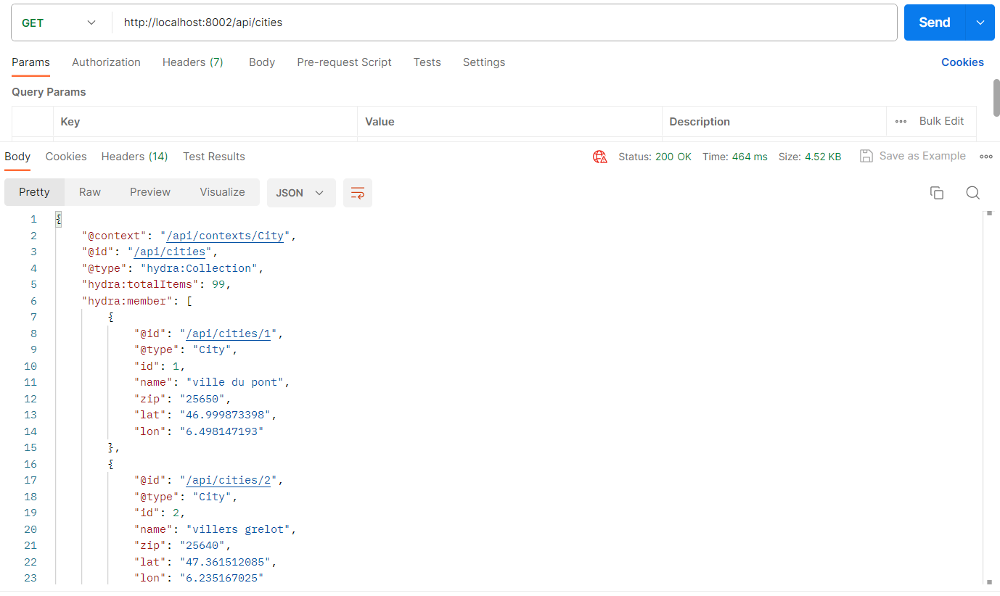
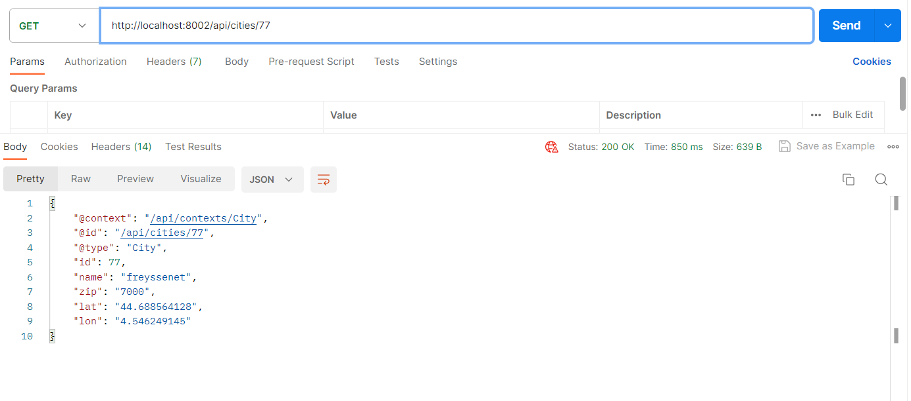
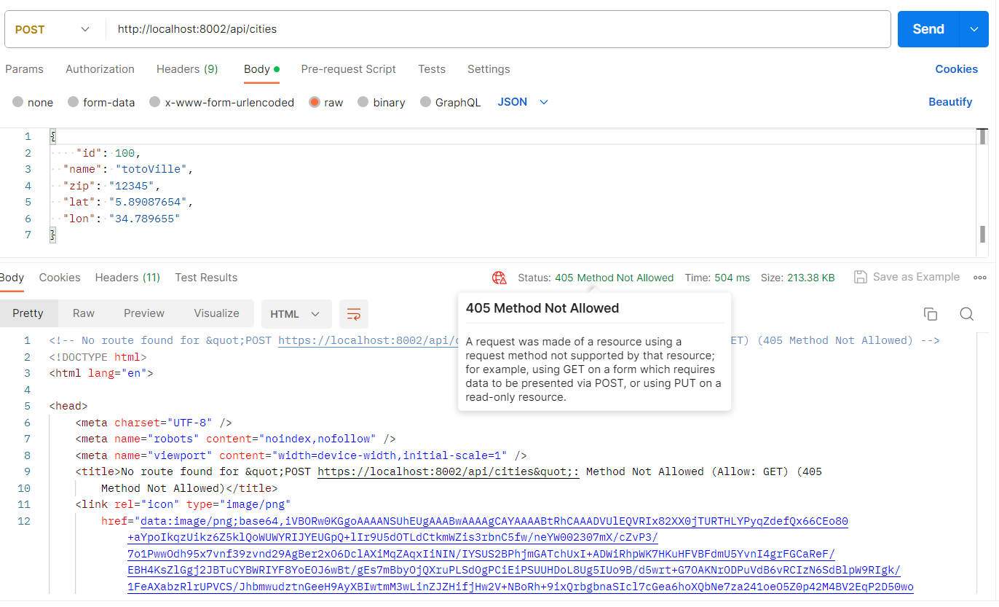
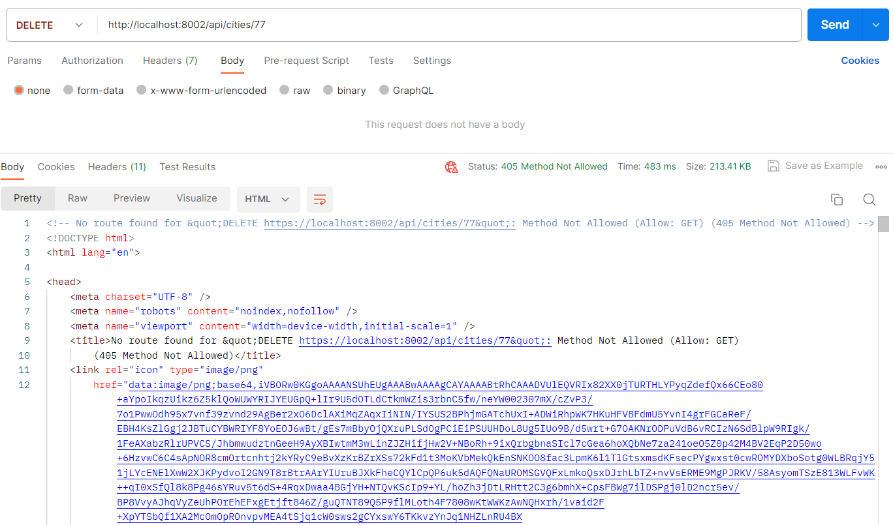
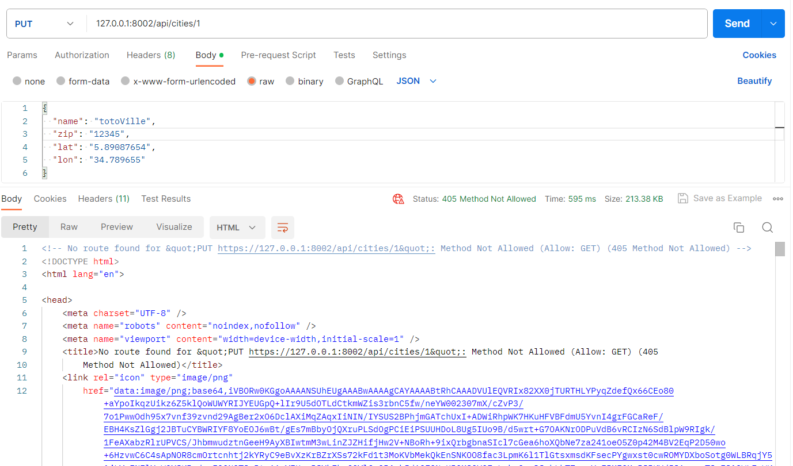

# Consommation de l'API City

### Rappel des fonctions de l'API City :
 L'API City a pour fonction d'interroger les données d'une table City de notre application contenant un nom de ville, un code postal, une latitude et une longitude à l'aide de méthodes GET

 ### Utilisation de l'API City :
 1. Notre API est basée sur api platform qui expose l'entité comportant l'annotation #[ApiResource()] (ici, nous exposons l'entité City de notre application) ... pour des raisons de sécurité, nous n'avons autorisé que l'application des méthodes GET, nous n'avons donc que 2 points d'entrée (endpoints) : 
 - /cities
 - /cities/{id}

 1. Si le souhait de l'utilisateur est d'interroger la liste complète des villes (cities) contenues dans la table City de la base de données de notre application, il suffira de taper l'url suivante :

    URL permettant d'effectuer un GET sur l'ensemble de la collection "cities" : [http://127.0.0.1:8002/api/cities](http://127.0.0.1:8002/api/cities)

    Vous obtiendrez ceci, par exemple avec Postman :

    

1. Si le souhait de l'utilisateur est d'interroger une ville (city) contenue dans la table City de la base de données de notre application, il suffira de taper l'url suivante : 
URL permettant d'effectuer un GET sur un item "city" en particulier : [http://127.0.0.1:8002/api/cities/{id}](http://127.0.0.1:8002/api/cities/77)

Avec Postman, pour tester ce point d'entrée, nous obtenu ceci en interrogeant la ville dont l'id est 77 :

    Le choix de l'interrogation s'effectue à l'aide de la propriété id d'une instance de l'entité City que l'on peut retrouver dans la liste complète des villes obtenue à l'aide de l'URL précédente ([http://127.0.0.1:8002/api/cities](http://127.0.0.1:8002/api/cities))

### Vérification des interdictions d'utilisation des méthodes POST, DELETE, PUT :

1. Méthode POST pour ajouter un enregistrement dans la table City :

La méthode POST n'est pas permise d'après le code retour 405, c'est ce que nous souhaitions ... d'ailleurs il est bien indiqué dans l'image ci-dessus que seule la méthode GET est autorisée (Allow: GET)
Mais ne croyons pas forcément tout ce que l'on nous dit et testons les autres méthodes !

2. Méthode DELETE pour supprimer un enregistrement dans la table City :

3. Méthode PUT pour modifier un enregistrement :

On voit ici que les attributs spécifiés dans l'annotation au dessus l'entité City ont bien été pris en compte et seules les méthodes GET sur une collection ou sur un item particulier sont autorisées

